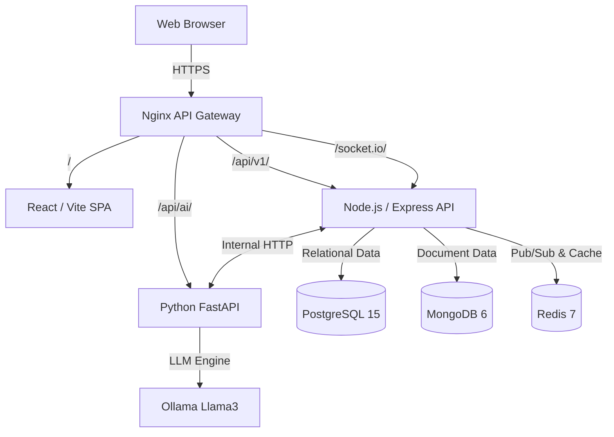

# HRGPT Architecture Overview

HRGPT employs a scalable, microservice-inspired architecture pattern utilizing Next-Gen AI models.

## High-Level Diagram

## Component Breakdown

1. **Nginx (API Gateway)**
   - Acts as the single entry point for all traffic on port 80/443.
   - Handles SSL termination, Gzip compression, and Request Rate Limiting.
   - Routes traffics based on URL paths.

2. **Frontend (React)**
   - Statically built via Vite. Served either through Nginx or a CDN like Vercel.
   - Uses Redux for state management and Socket.io-client for real-time WebSockets.

3. **Backend (Node.js)**
   - Express server providing RESTful endpoints.
   - Handles business logic, RBAC authentication (JWT), and file uploads.
   - Uses **Prisma ORM** for structured HR data (PostgreSQL).
   - Uses **Mongoose** for unstructured/flexible data like Chat Histories (MongoDB).
   - Utilizes `EventEmitter` and Redis for real-time collaboration scaling.

4. **AI Service (Python)**
   - FastAPI server optimized for heavy ML computation.
   - Interfaces with Ollama for open-source LLM generation (Llama 3).
   - Responsible for resume parsing, interview scoring, and AI chat orchestration.
