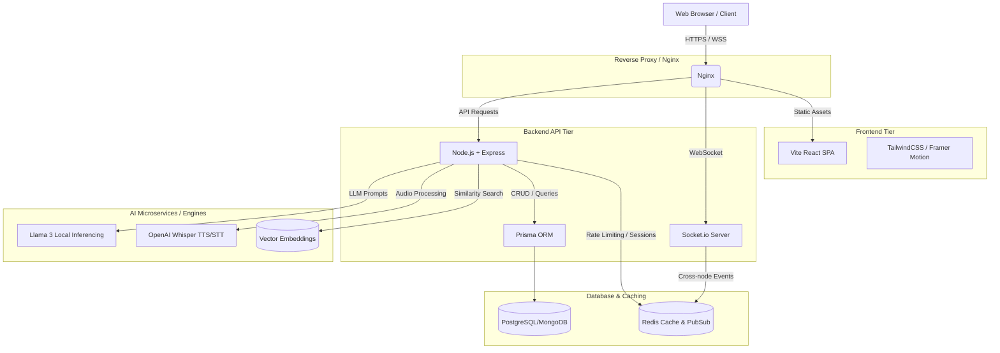

# HRGPT Platform Architecture

HRGPT is designed as a scalable, modern Monorepo utilizing a decoupling strategy between the real-time node backend and a Vite-React SPA frontend.

## High-Level Architecture Diagram

## Technology Stack

### Frontend
- **Framework:** React 18 (Vite)
- **Routing:** React Router v6
- **Styling:** Tailwind CSS, Framer Motion for micro-animations
- **State Management:** React Context + Zustand (for Copilot)
- **Data Fetching:** Axios, React Query
- **Charts:** Recharts

### Backend
- **Framework:** Node.js, Express, TypeScript
- **Database:** MongoDB (via Prisma ORM / Mongoose fallback)
- **Real-Time:** Socket.io, Redis Pub/Sub
- **Auth:** JWT (Access + Refresh token rotation), bcryptjs
- **Security:** Helmet, rate-limiting, HPP

### AI & Infrastructure
- **Embeddings:** HuggingFace / OpenAI for Vector Embeddings.
- **Evaluation Engine:** Prompts structured for Llama 3 8B.
- **Docker:** Multi-stage Dockerfiles for production builds.
- **CI/CD:** GitHub Actions.
